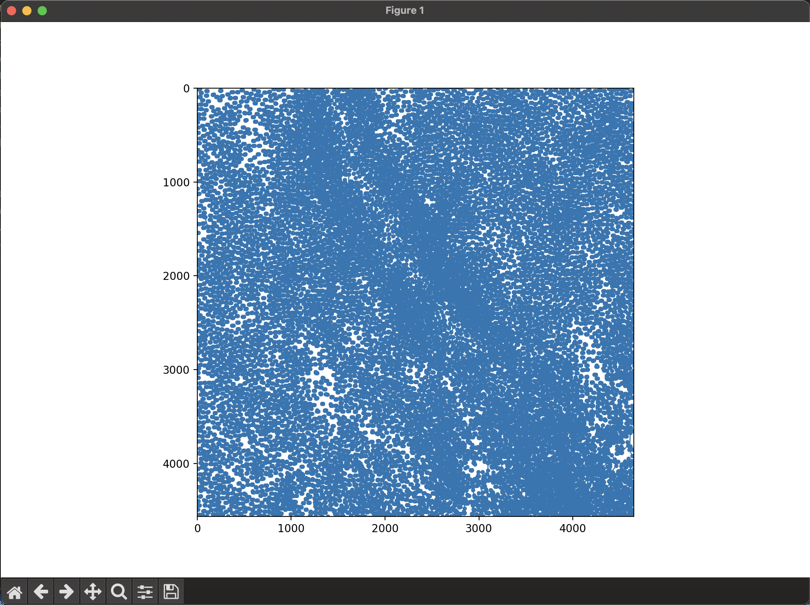
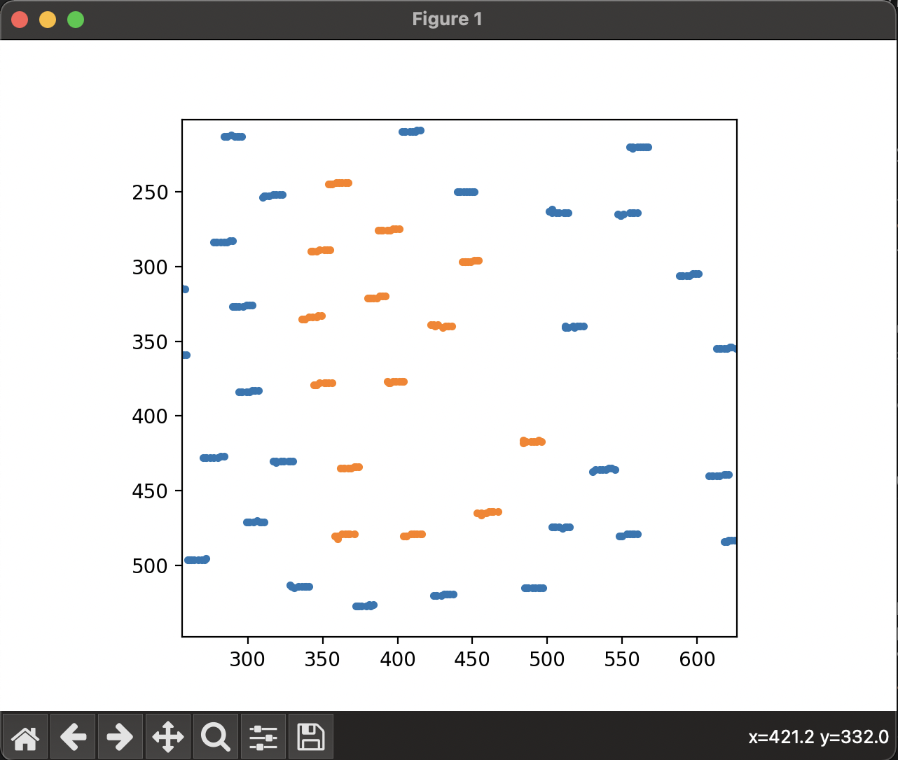
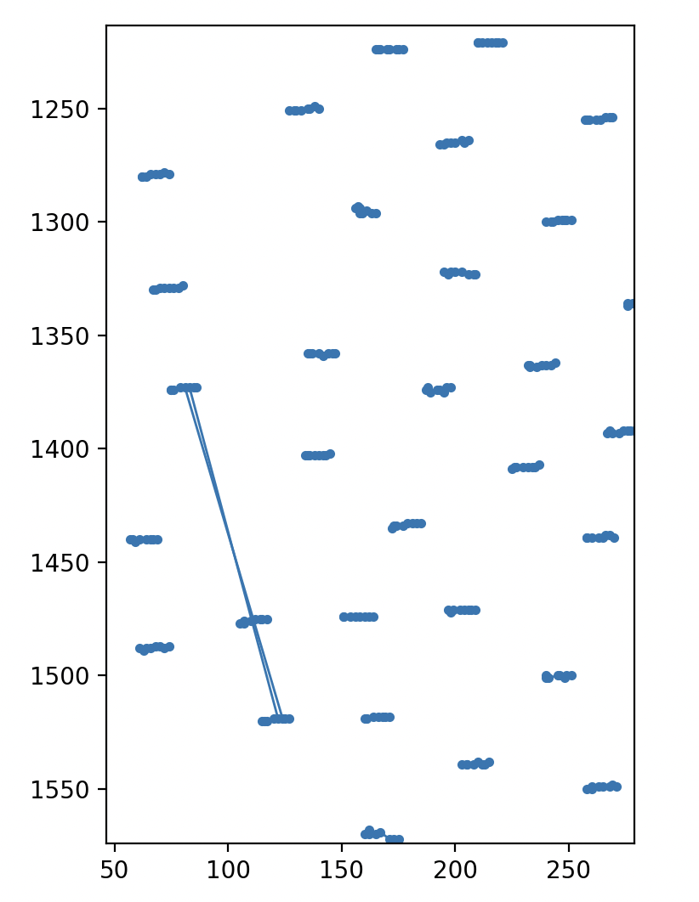
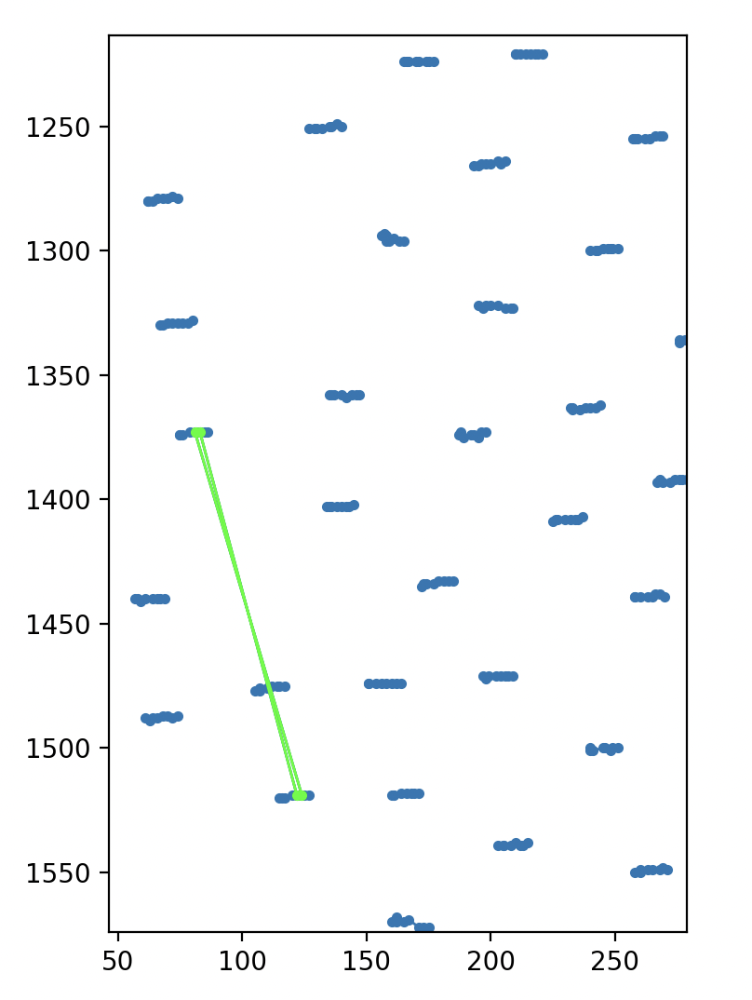
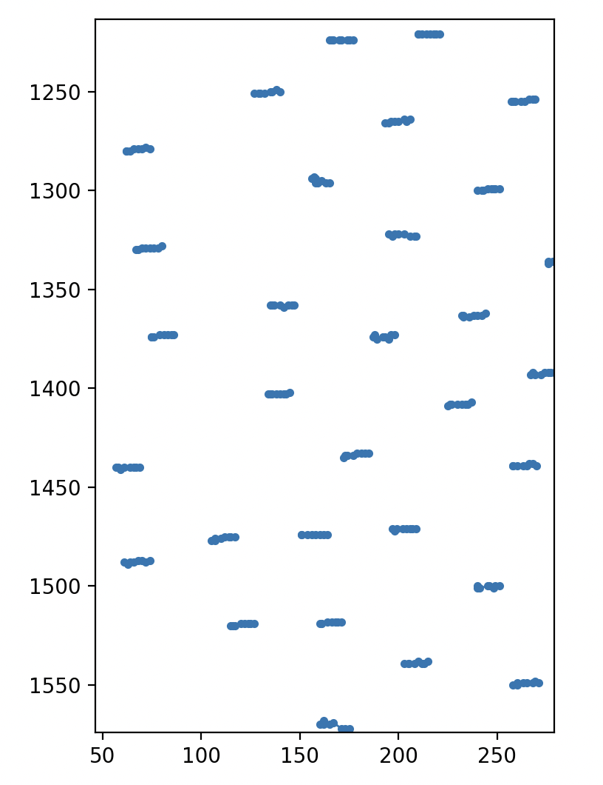
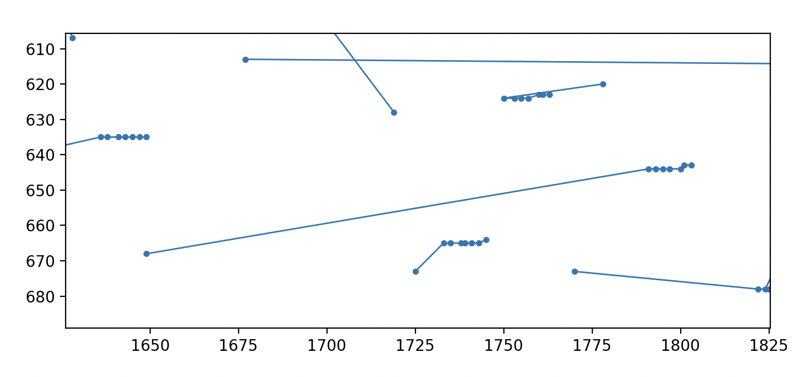
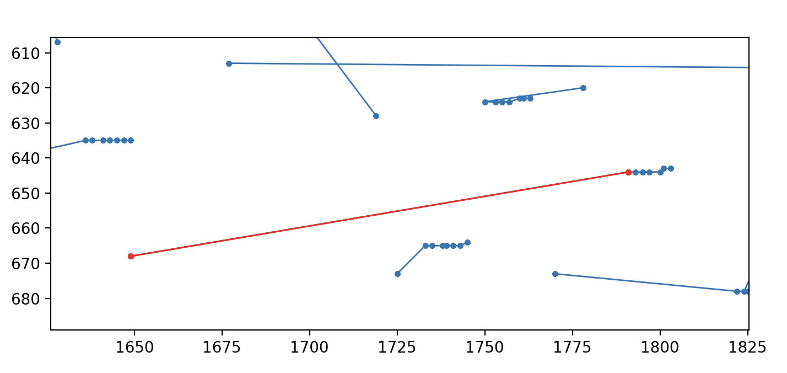
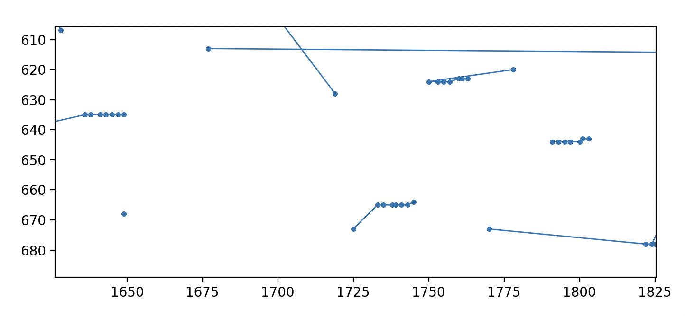

# Droplet Tracking

Repository for the 2022 Data Science Lab Project. Section `Prerequisites` describes
how to set up environment. Section `Training` describes how to train a neural network
using the framework. Section `Layout` describes the content and organization of this
repository. Section `Utils` describes briefly what the main utlity functions are.


## Prerequisites

### Software

1. PLEASE READ THE WHOLE SECTION BEFORE EXECUTING ANYTHING. At the moment, a basic environment is given in `utils/env_prefixless.yml` and can be installed by running. 
    ```
    conda env create -f env_prefixless.yml
   ```
   As far as I understand, this will install the environment in the default conda/miniconda envs directory.
   To install the env in a specific location, use 
   ```
    conda env create --prefix <path to desired directory> -f env_prefixless.yml
   ```

   If you are on MacOS and using homebrew, and have installed miniconda over homebrew, you probably want / need to change the prefix to point to the miniconda directory inside the homebrew filespace. To that end, you may want to try and use `utils/env_brewprefix.yml` which already contains a prefix that should point to the correct location within the homebrew system so you do not have to pass a `--prefix` option when creating the conda env. If you use conda inside homebrew on a mac, you will also probably need to execute python via the `/opt/homebrew/Caskroom/miniconda/base/envs/<env name here (should be "dsl" if everything goes right)>/bin/python3` command if you do not change the default python path (which is not recommeneded as python is already installed on the mac and the system depends on that installation).

### Images

1. The nd2reader library does not work on all images. Instead, we use the nd2 library.  To that end, `get_image_as_ndarray` in `utils/raw_image_reader.py` can be used to extract frames and channels as numpy arrays from the nd2 image.

### Datasets

1. Currently, we have 3 images (small movement 1, 2, and 3) for which we have detected droplets and cells. The datasets are in `utils/droplets_and_cells/finished_outputs`. In there you will find the csv tables for both droplets and cells for all three images mentioned above. Additionally, you can also find the legacy dataset for the image "small movement 1" which has a `legacy` at the end of its name.
To create a "droplet dataset" from these csv files, one needs to use the according nd2 image (that matches the droplet csv file) and the function `create_dataset` in `utils/droplet_retreiver.py` which should be documented.
This droplet dataset will give you a sort of list of all droplets together with cut out image patches where the droplet is located.

2. The cells dataset can be used to augment the droplet dataset (see point 3.) as it allows to read off the intensity and persistency scores (and also the locations) of all the signal-spikes that have been detected in the various droplets, which can then be used to improve the accuracy of similarity scores.
The "intensity score" of the cells is related to the "height" of the spike in the DAPI channel, relative to the background noise.
In detail, the score measures how high the intensity of the peak is, and the units are 10 * standrad deviation of the estimated noise.
On the other hand, the "persistency score" is related to how "wide" the detected peaks are.
The persistence score computes the average distance in pixels from the peak location, to the 10 closest pixels which are categorized as "noise". 
I.e., it is an estimate of the margin between the peak center and the closest point "where the noise begins".
In the legacy dataset, the scores were squashed between 0 and 1 to make it a bit more scale invariant but I found that the loss of precision was significant when we actually want to work with the raw / unsquashed measurements. For this reason, in the new datasets, the scores are not between 0 and 1 anymore, but rather 0 and infinity.
The intensity and persistence scores will in general be reasonably positively correlated but there are cases where one can be big and the other one small and vice versa.
IMPORTANT: The "persistence score" is not available in the legacy dataset. 
IMPORTANT: The scores in the new datasets are not squashed between 0 and 1 and are between 0 and infinity instead. 

3. To get the combined information of the cells and droplets dataset (ie, get additional information about all significant peaks in each droplet), you can use `create_dataset_cell_enhanced` in `utils/droplet_retreiver.py`. This function will give the same output as the `create_dataset` function, except that additonally, in each entry corresponding to a droplet and frame in the returned dataset, there will be an additional column "cell_signals" which is a pandas dataframe (I think) which contains all information about all detected peaks in the corresponding droplet and frame. So basically each entry in the returned dataset contains a column which is again a dataframe which contains significant spikes in the DAPI channel. This nested dataframe has multiple columns telling you various scores about the detected peaks, their locations and their IDs.


### Visualization

1. The visualization tool can be executed by calling `visualizer.py` (example given below).

2. The visualizer has some neat features. After executing the vsiualizer, a small window should pop up, like this:



If you click on the magnification glass on the bottom left, you can select a region on the image via left click-and-drag and focus on the selected part of the image.
If you click on the home buttoin, you will return to the top-most view of the image.
If you click on the left- and right-arrow buttons on the bottom left, you can go back and forth between "focus-levels" you had selected.
The floppy disc icon allows you to store a screenshot of the currently displayed stuff.
The symbol with the 4 arrows in each direction allows you to pan over the image.
By clicking `f` you can switch between fulscreen mode and normal mode.
The visualizer can be exited by pressing `q`.
By pressing the buttons 0 to 9 one can overlay the brightfield images of the corresponding images of 0 up to 9. (Note that the first frame is frame 0, not frame 1).

3. The visualizer also has some tools with which one can repair faulty trajectories and store a specific selection of droplets. The command line from where the visualizer was executed should also show information on how to use the tools. There are 3 main tools: 

4. Selection tool: If one does a left-click and draws a path/region with the mouse, the visualizer will compute which droplets are inside the region drawn (the first occurrence of the droplet is used, i.e. frame 1) by you and mark those droplets as droplets to "keep" (more on that later) and they will be marked orange. You can keep adding droplets with this region-selection tool anytime. When you are done selecting droplets, you can press 'c' which will take all those droplets marked as "keep" (the orange ones), and create a new csv file with those exclusively. All other droplets will not be present in this new csv file. The command line should give information on where this file is stored and on what its name is. Typically theis file will be stored under `/data/05_results/results_<imagename>_<date>.csv`. Here is an example of how selected droplets appear as orange:



5. Swap tool: Sometimes the automatic tracking algorithm will get confused between two nearby droplets and mess up the tracking in one specific frame, while the tracking between all other frames is perfectly fine. Here is an example: 



It is easy for a person to see that here the tracking algorithm just messed up in one single frame and that the movement of the droplets is simply a very slow horizontal movement and that the jump of the two trajectories is clearly wrong and that the jump should not happen. To allow a manual correction of these easy-to-see errors, the visualizer has the "swap tool". The swap tool works like this: First you press `a` to activate the tool (`a` will also again de-activate the tool. Check the command line for teh current status of the tool). One then selects two edges (which must represent droplet movements between the same two frames, e.g. frame 1 and 2) by clicking on them with the mouse. The two selected edges will be marked in green. If you are happy with the selection, you can then press 'enter' to confirm the swap between the two selected edges. The swap will bascially exchange the selected edges. After the swap is confirmed, the tool is deactivated automatically and must be re-activated by pressing `a` again. Here is an example:

Select the edges:



Press enter to confirm swap and repair the trajectories:



Of course, swapping is only allowed if the selected edges "happen at the same time", i.e. represnet movement between the same two frames.
If one clicks on more than 2 edges, teh program will simply consider the last two clicked edges as selected edges. If one clicks on two edges that are not "at the same time", the program will assume the last selected edge has the correct time and will adjust the other edge to be at the same time.

6. Cut tool: Sometimes trackings are just simply wrong but perhaps the tracking is wrong only between frame 0 and 1 while for all other frames the tracking is perfect. In such cases it makes sense to just cut the link between frame 0 and 1 for one single droplet, while keeping the links between all other frames intact. This way one can still make use of the correct tracking for the remaining frames without having to discard everything. An example of such a case is:



where the long line in the center is not possible due to ther droplets being in the way.
This is where the cut tool comes into play. The cut tool is activated by pressing `w`. Then one can select an edge by left click, which will highlight the edge in red.



By pressing enter one can then confirm the edge to be cut, which will basically cut the trajectory at the selected edge and split the trajectory into two new, disjoint trajectories.



Afterwards one can use the selection tool described before to select the good trajectory and store it in a table.


### Droplet detection

1. Droplet detection can be performed by executing `utils/droplets_and_cells/droplets_and_cells.py`. 
This function will also detect cells. It will measure peaks in the DAPI channel to find possible cells. Not all significant peaks will however be counted towards the "nr_cells" column in the droplet dataset. 
Only signals that surpass a certain threshold will be counted towards the "nr_cells" columns in the `droplets.csv` dataset. 
However, all detected signifcant peaks will be outputted to the `cells.csv` dataset. 
So combining the "cells" and "droplets" datasets is recommended as they complement each other.

## Training and using Deep Learning Features

1. Analysing regular images
   * In this scenario, no training is needed. Simply running the code via `python main.py` is enough. If embeddings have already been created (if a file called `embeddings_{image_name}.csv` is already present
   in `data/03_features`), then one can pass the flag `-g` in order not to re-generate the embeddings, and speed up the overall process.
   Not using embeddings is also possible, by passing the flag `-e`.

2. Using on another dataset
   * Here two distinct options are possible. If a training dataset is already present (composed of several droplet images), alter the file `experiments/model.toml` and place the training dataset and validation
   datasets paths in, respectively, `train_dataset` and `val_dataset`. If it is not, the model will be trained on the generated droplet images. While training, under `experiments/{image_name}` a new checkpoint
   will be created. After the code finishes running, in order to not retrain the model when analysing newer images, replace the path present on `experiments/0003.toml`, in the line
   checkpoint with the latest present checkpoint. Suppose, for instance that the image name is `smallmovement1`. Then there should be a folder `experiments/smallmovement1/000/_____.pt`. In this scenario,
   one should then replace `checkpoint={previous value}` with `checkpoint=experiments/smallmovement1/000/_____.pt`.
   * In order to train a new model, pass the flag `-t` to `python main.py`.

   
